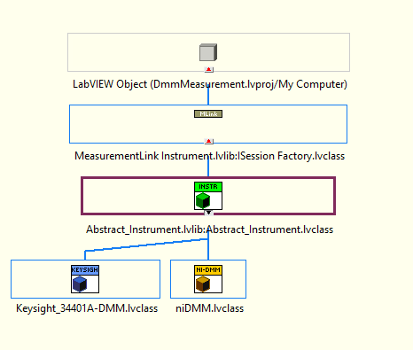

# Hardware abstraction measurement workflow in MeasurementLink

A MeasurementLink compatible Hardware Abstraction Layer (HAL) for Instruments can be implemented using OOP leveraging PinMap with minimal effort.

A new instrument model can be included with help of existing object-oriented HAL libraries in the `DmmMeasurement' example or an existing object-oriented class based HAL implementation can be migrated into MeasurementLink measurements.

## Pre-requisites

* Familiar with creating and debugging measurement plugins in MeasurementLink.
* Familiar with LabVIEW object-oriented programming along with class based hardware abstractions.
* Deep knowledge of architecture and implementation of existing HAL (migrate to use with MeasurementLink measurements).

## Existing HAL Helper Libraries in MeasurmentLink

The `DmmMeasurement` example in [Github](https://github.com/ni/measurementlink-labview/tree/users/prem/dmm-hal-implementation/Source/Example%20Measurements/DMM%20Measurement) repository uses HAL for different dmm instruments.

The object-oriented HAL library can be used to implement new instrument models.

The HAL library implementation involves the following modules or classes:

* Abstract_Instrument - The base template class for the instrument models. This [factory class](https://en.wikipedia.org/wiki/Factory_method_pattern) [method](https://github.com/ni/measurementlink-labview/blob/users/prem/dmm-hal-implementation/Source/Example%20Measurements/DMM%20Measurement/DmmMeasurement/HAL/Instruments/Base/Utility/Get_Instrument_Instances.vi) dynamically initializes  the instrument model classes based on the pin selected in measurement UI.
* Instrument Type base - The base template class for the instrument type specific measurement functions (These functions's are called in the measurement core).
* Instrument Model - The implementations of various categories of instrument models.

    

## HAL Workflow

### Create new instrument model with help of existing HAL libraries

1. Create or clone the most relatable instrument model child and add it to example project.
2. Ensure the instrument model child classes created inherits the instrument type base class. For example , [DMM instrument type base class](https://github.com/ni/measurementlink-labview/blob/users/prem/dmm-hal-implementation/Source/Example%20Measurements/DMM%20Measurement/DmmMeasurement/HAL/Instruments/DMM_Base/DMM_Base.lvclass) for DMM instruments.
3. In case if the instrument model doesn't belong to available instrument type classes follow [steps to create new instrument type](#new-instrument-type-base-with-help-of-existing-hal-libraries).
4. Implement the overriding methods from the base classes (Abstract_Instrument, Instrument type base).
   1. Overriding methods from `Abstract_Instrument` class
      1. Initialize MeasurementLink Session.vi
      2. Get Provided Interface and Service Class.vi
      3. Close MeasurementLink Session.vi
   2. Overriding instrument measurement methods from `Instrument type` base class
      1. Configure, Measure and so on (Methods varies for each instrument types).

### New instrument type base with help of existing HAL libraries

1. Create a class and inherit [Abstract_Instrument](https://github.com/ni/measurementlink-labview/blob/users/prem/dmm-hal-implementation/Source/Example%20Measurements/DMM%20Measurement/DmmMeasurement/HAL/Instruments/Base/Abstract_Instrument.lvclass).
2. Define the `Dynamic Dispatch` methods to do the instrument type measurement functions (Such as initialize instrument, configure, measure).
3. Define the inputs and outputs to the `Dynamic Dispatch` methods.

### Migrate the existing instrument class abstraction to MeasurementLink

1. Create new blank LabVIEW project to include the new measurement if required.
2. Clone most relatable example measurement library of [MeasurementLink Repository](https://github.com/ni/measurementlink-labview/tree/main/Source/Example%20Measurements) and add it to the project.
3. Add [HAL reusable of MeasurementLink](https://github.com/ni/measurementlink-labview/tree/users/prem/dmm-hal-implementation/Source/Example%20Measurements/DMM%20Measurement/DmmMeasurement/HAL) into the project.
4. Copy the existing instrument abstraction classes and its reusable to the example project.
5. Ensure that the instrument base class inherit [Abstract_Instrument](https://github.com/ni/measurementlink-labview/blob/users/prem/dmm-hal-implementation/Source/Example%20Measurements/DMM%20Measurement/DmmMeasurement/HAL/Instruments/Base/Abstract_Instrument.lvclass).
6. Modify the `\Abstract_Instrument\Base\Utility\Get_Instrument_Path.vi` to get the instrument model child classes path.
7. Add Dynamic Dispatch vi's to the "Instrument Type base" classes to perform `Initialize, configure and measure` (These API's can be used in measurement code to perform the measurement).
8. Create and implement the following overriding methods.
   1. Overriding methods from `Abstract_Instrument` class
      1. Initialize MeasurementLink Session.vi
      2. Get Provided Interface and Service Class.vi
      3. Close MeasurementLink Session.vi
   2. Overriding methods from `Instrument type` base class
      1. Configure, Measure and so on (Methods varies for each instrument types).

`NOTE :` For more detailed information on workflow check [Detailed_HAL_Workflow_in_MeasurementLink.md](https://github.com/ni/measurementlink-labview/blob/users/prem/dmm-hal-implementation/Source/Example%20Measurements/DMM%20Measurement/HAL%20Workflow/Detailed_HAL_Workflow_in_MeasurementLink.md).
