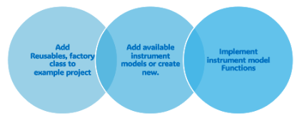

# Hardware abstraction measurement workflow in MLink

The measurements in MeasurementLink can be easily modified to implement hardware abstraction to switch between different instrument models of same instrument type easily via pinmap file.

A new instrument model can be included with help of existing HAL libraries in the `DmmMeasurement' example or an existing HAL implementation in different framework can be ported.

## Pre-requisites

* Basic MeasurementLink plugin workflow understanding.
* LabVIEW experience.
* Basic understanding of existing HAL implementation in case of porting existing HAL implementation from other framework.

## Existing HAL Helper Libraries in MeasurmentLink

The `DmmMeasurement` example in [Github](https://github.com/ni/measurementlink-labview/tree/users/prem/dmm-hal-implementation/Source/Example%20Measurements/DMM%20Measurement) repository implements HAL for different dmm instruments.

We can reuse this hal library to implement our own instrument implementation.

The HAL library implementation involves the following modules or classes:

* Abstract_Instrument - The base template for the actual instrument models. It is also a factory class which follows factory design pattern to call the instrument model functions based on the pin we are selecting in measurement UI.
* Instrument Model - The specific instrument model implementations.

    

## Workflow

### Create new instrument model with help of existing HAL libraries

1. Create new blank LabVIEW project to include the new measurement if required.
2. Clone most relatable example measurement library of [MeasurementLink Repository](https://github.com/ni/measurementlink-labview/tree/main/Source/Example%20Measurements) and add it to the project.
3. Add [HAL reusable of MLink](https://github.com/ni/measurementlink-labview/tree/users/prem/dmm-hal-implementation/Source/Example%20Measurements/DMM%20Measurement/DmmMeasurement/HAL) into the project.
4. Create or clone the most relatable instrument model child and implement the overriding methods according to instrument.
5. Please ensure that any child classes you create inherit from the [base class](https://github.com/ni/measurementlink-labview/blob/users/prem/dmm-hal-implementation/Source/Example%20Measurements/DMM%20Measurement/DmmMeasurement/HAL/Instruments/Base/Abstract_Instrument.lvclass) following the factory design pattern.
6. Implement the overriding methods from the Abstract_Instrument base class.
7. Make changes to `Measurement Logic.vi` of the example library to send in the inputs to measurement API's like `Initialize, Configure, Measure`.
8. Make the measurement UI changes (inputs and output results of measurement) in the example library.
9. Run service.
10. Use InstrumentStudio or Teststand to start the measurement.

### Migrate the instrument abstraction hierarchy of another framework to MLink

1. Create new blank LabVIEW project to include the new measurement if required.
2. Clone most relatable example measurement library of [MeasurementLink Repository](https://github.com/ni/measurementlink-labview/tree/main/Source/Example%20Measurements) and add it to the project.
3. Add [HAL reusable of MLink](https://github.com/ni/measurementlink-labview/tree/users/prem/dmm-hal-implementation/Source/Example%20Measurements/DMM%20Measurement/DmmMeasurement/HAL) into the project.
4. Add the older framework instrument abstraction and its reusable to the project.
5. Ensure that the instrument base class inherit [Abstract_Instrument Factory](https://github.com/ni/measurementlink-labview/blob/users/prem/dmm-hal-implementation/Source/Example%20Measurements/DMM%20Measurement/DmmMeasurement/HAL/Instruments/Base/Abstract_Instrument.lvclass).
6. Modify the `\Abstract_Instrument\Base\Utility\Get_Instrument_Path.vi` to form the instrument model class path suppose if the folder structure of the other framework HAL classes is different.
7. Create and implement the overriding methods from the Abstract_Instrument base class.
8. Make changes to `Measurement Logic.vi` of the example library to send in the inputs to measurement API's like `Initialize, Configure, Measure`.
9. Make the measurement UI changes (inputs and output results of measurement) in the example library.
10. Run service.
11. Use InstrumentStudio or Teststand to start the measurement.

`NOTE :` For more detailed information on workflow check [Detailed_HAL_Workflow_in_MLink.md](https://github.com/ni/measurementlink-labview/blob/users/prem/dmm-hal-implementation/Source/Example%20Measurements/DMM%20Measurement/HAL%20Workflow/Detailed_HAL_Workflow_in_MLink.md).
