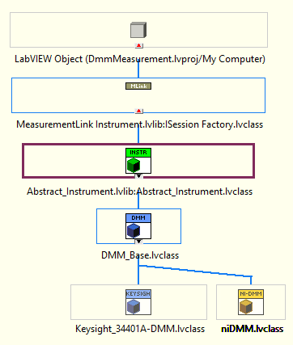

# Hardware abstraction measurement workflow in MeasurementLink

A MeasurementLink compatible Hardware Abstraction Layer (HAL) for Instruments can be implemented using OOP leveraging PinMap with minimal effort.

A new instrument model can be included with help of existing HAL libraries in the `DmmMeasurement' example or an existing object-oriented class based HAL implementation can be migrated into MeasurementLink measurements.

## Pre-requisites

* Familiar with creating and debugging measurement plugins in MeasurementLink.
* Familiar with LabVIEW object-oriented programming and familiar with class based hardware abstractions.
* Deep knowledge of architecture and implementation of existing HAL (migrate to use with MeasurementLink measurements).

## Existing HAL Helper Libraries in MeasurmentLink

The `DmmMeasurement` example in [Github](https://github.com/ni/measurementlink-labview/tree/users/prem/dmm-hal-implementation/Source/Example%20Measurements/DMM%20Measurement) repository uses HAL for different dmm instruments.

The object-oriented HAL library can be used to implement our own instrument implementation.

The HAL library implementation involves the following modules or classes:

* Abstract_Instrument - The base template class for the instrument models. This [factory class](https://en.wikipedia.org/wiki/Factory_method_pattern) dynamically calls the instrument model functions based on the pin selected in measurement UI.
* Instrument Model - The implementations of various categories of instrument models.

    

## HAL Workflow

### Create new instrument model with help of existing HAL libraries

1. Create new blank LabVIEW project to include the new measurement if required.
2. Clone most relatable example measurement library of [MeasurementLink Repository](https://github.com/ni/measurementlink-labview/tree/main/Source/Example%20Measurements) and add it to the project.
3. Add [HAL reusable of MeasurementLink](https://github.com/ni/measurementlink-labview/tree/users/prem/dmm-hal-implementation/Source/Example%20Measurements/DMM%20Measurement/DmmMeasurement/HAL) into the project.
4. Create or clone the most relatable instrument model child and implement the overriding methods according to instrument.
5. Please ensure that any child classes you create inherit from the [base class](https://github.com/ni/measurementlink-labview/blob/users/prem/dmm-hal-implementation/Source/Example%20Measurements/DMM%20Measurement/DmmMeasurement/HAL/Instruments/Base/Abstract_Instrument.lvclass) following the factory design pattern.
6. Implement the overriding methods from the Abstract_Instrument base class.

### Migrate the instrument abstraction hierarchy of another framework to MeasurementLink

1. Create new blank LabVIEW project to include the new measurement if required.
2. Clone most relatable example measurement library of [MeasurementLink Repository](https://github.com/ni/measurementlink-labview/tree/main/Source/Example%20Measurements) and add it to the project.
3. Add [HAL reusable of MeasurementLink](https://github.com/ni/measurementlink-labview/tree/users/prem/dmm-hal-implementation/Source/Example%20Measurements/DMM%20Measurement/DmmMeasurement/HAL) into the project.
4. Copy the older framework instrument abstraction and its reusable to the project.
5. Ensure that the instrument base class inherit [Abstract_Instrument Factory](https://github.com/ni/measurementlink-labview/blob/users/prem/dmm-hal-implementation/Source/Example%20Measurements/DMM%20Measurement/DmmMeasurement/HAL/Instruments/Base/Abstract_Instrument.lvclass).
6. Modify the `\Abstract_Instrument\Base\Utility\Get_Instrument_Path.vi` to format the instrument model class path.
7. Create and implement the overriding methods from the Abstract_Instrument base class.
   1. Initialize MeasurementLink Session.vi
   2. Get Provided Interface and Service Class.vi
   3. Get Instrument Type ID.vi
   4. Close MeasurementLink Session.vi
   5. Measure.vi
   6. ConfigureMeasurementParameters.vi

`NOTE :` For more detailed information on workflow check [Detailed_HAL_Workflow_in_MeasurementLink.md](https://github.com/ni/measurementlink-labview/blob/users/prem/dmm-hal-implementation/Source/Example%20Measurements/DMM%20Measurement/HAL%20Workflow/Detailed_HAL_Workflow_in_MeasurementLink.md).
