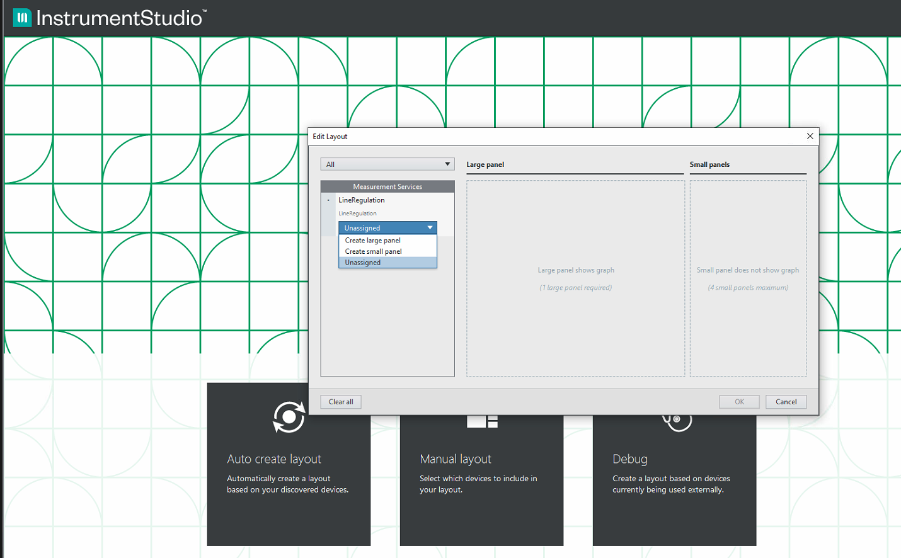

# LabVIEW MeasurementLink™ Services

- [LabVIEW MeasurementLink™ Services](#labview-measurementlink--services)
  - [Introduction](#introduction)
  - [Dependencies](#dependencies)
  - [Software support](#software-support)
    - [Supported versions of LabVIEW](#supported-versions-of-labview)
    - [Supported version of InstrumentStudio](#supported-version-of-instrumentstudio)
  - [Installation](#installation)
  - [Developing a LabVIEW measurement](#developing-a-labview-measurement)
  - [Running a LabVIEW measurement](#running-a-labview-measurement)
  - [Example Measurements](#example-measurements)
    - [Dependencies for the example measurements](#dependencies-for-the-example-measurements)
    - [Running the LDO measurement example](#running-the-ldo-measurement-example)
  - [Using the measurement in InstrumentStudio](#using-the-measurement-in-instrumentstudio)
  - [Creating a LabVIEW executable for static registration](#creating-a-labview-executable-for-static-registration)
  - [Statically registering LabVIEW measurements](#statically-registering-labview-measurements)

---

## Introduction

The LabVIEW MeasurementLink packages enable measurement developers to quickly create LabVIEW measurements and run them as a service(gRPC). Additionally, the `Measurement Framework` plugin allows users to interact with MeasurementLink services with LabVIEW UI in InstrumentStudio.

---

## Dependencies

Set up the following software before installing the given packages.

- VI Package Manager 2020
- LabVIEW 2020 SP1 or higher.
- InstrumentStudio- Latest available from `\\argo\ni\nipkg\feeds\ni-i\ni-instrumentstudio\`
- Measurement Framework Latest available from `\\argo\ni\nipkg\feeds\ni-m\ni-measurement-framework\`

---

## Software support

### Supported versions of LabVIEW

- [LabVIEW 2020(64-bit)](https://www.ni.com/en-us/support/downloads/software-products/download.labview.html#345658)
- [LabVIEW 2020 SP1(64-bit)](https://www.ni.com/en-us/support/downloads/software-products/download.labview.html#369659)
- [LabVIEW 2021(64-bit)](https://www.ni.com/en-us/support/downloads/software-products/download.labview.html#411431)
- [LabVIEW 2021 SP1(64-bit)](https://www.ni.com/en-us/support/downloads/software-products/download.labview.html#443865)

### Supported version of InstrumentStudio

- InstrumentStudio from `\\argo\ni\nipkg\feeds\ni-i\ni-instrumentstudio\`.

---

## Installation

1. Install the latest build of InstrumentStudio from `\\argo\ni\nipkg\feeds\ni-i\ni-instrumentstudio\`.
2. Install the latest measurement service SDK from the network location `\\argo\ni\nipkg\feeds\ni-m\ni-measurementlink-development\`.
3. Download and install the LabVIEW MeasurementLink packages in the following order.
    1. `ni_lib_labview_grpc_library-x.x.x.x.vip` - Required
    2. `ni_lib_labview_grpc_servicer-x.x.x.x.vip` - Required
    3. `ni_lib_discovery_client-x.x.x.x.vip` - Required
    4. `ni_lib_labview_measurementlink_template-x.x.x.x.vip` - Required
    5. `ni_lib_labview_measurementlink_editor-x.x.x.x.vip` - Required

---

## Developing a LabVIEW measurement

1. Create a new LabVIEW project (say Measurement.lvproj) and open it.

2. From the project window, go to `Tools` → `Measurement Framework` → `Measurement Plugins` → `New...` which opens a new measurement creation dialog.
    - In the new dialog, enter the `Measurement Service Name` that you would like to give to the measurement and click `Create Measurement Service`.

        

    - This will create a new measurement service library in the project with the required assets for developing a measurement service.

        

3. Add the measurement details in the block diagram of the `Get Measurement Details.vi` including:
    - display name
    - version
    - measurement type
    - product type
    - service id

    

4. Add the required controls for the configuration parameters in the `Measurement Configuration.ctl` file. By default, this comes with `Array in` which is a double array.

    

5. Add the required indicators for the output parameters in the `Measurement Results.ctl` file. By default, this comes with the `Array out` parameter which is a double array.

    

6. Provide the measurement logic in the `Measurement Logic.vi` file. This file will have the configuration and the output parameters readily available from `Measurement Configuration.ctl` and `Measurement Results.ctl`. By default, the logic takes the `Array in` and stores it in `Array out`.

    

7. Create the user interface in `Measurement UI.vi` under the `<LibraryName>.lvlib\`. The control and indicator names in the user interface should match the `Measurement Configuration` and `Measurement Results`. If the data type and name match, then the data from the UI will send to the logic before execution, and the results will be published to UI after the measurement is run. By default, the UI file consists of an 'Array In' control and 'Array Out' indicator.

    

Note: 

- Additional info could be found in the to-do sections in the code, this can be viewed using `Bookmark Manager` - You can open it from LabVIEW → `View` → `Bookmark Manager`. In this window, you can find the bookmark term `#MeasurementToDo`, double-clicking on the items will take you to all the VIs where changes can be done to create a measurement.
- Scalars(int, double, uint, sint, string, boolean) and DoubleArray are the supported datatypes for the `Configuration` and `Output` parameters of the measurement.

---

## Running a LabVIEW measurement

To run the measurements, follow the below steps

1. Open `<MeasurementName>.lvproj` that contains the Measurement Service library.

2. Start the discovery service if the measurement is to be used in InstrumentStudio Measurement Framework.

3. Run the `Run Service.vi` from `<MeasurementName>.lvlib` to run the measurement service from `<MeasurementName>.lvproj`

4. To manually stop the service, click on the `Stop` button from the front panel of `Run Service.vi`.

---

## Example Measurements

The example measurements provided contain the following projects:

- **LDO measurement**: The project performs simple LDO measurements. The type of LDO measurements performed are:
  - Line Regulation
  - Load Regulation

### Dependencies for the example measurements

1. LabVIEW 2020 64 bit
2. NI-DC Power driver.
3. NI-DMM driver.

### Running the LDO measurement example

To run the measurements, follow the steps mentioned below:

1. Open `LDOMeasurements.lvproj` from the examples provided.

2. Start the discovery service if the measurement is to be used in InstrumentStudio Measurement Framework.

3. Run the following VI to run the measurement service from `LDOMeasurements.lvproj`
    -To run Line Regulation, run `Run Service.vi` from `LineRegulation.lvlib`
    -To run Load Regulation, run `Run Service.vi` from `LoadRegulation.lvlib`

4. Use the `Measurement Framework` and run the measurements interactively in InstrumentStudio. For more details, please refer to the section [Using the Measurement Framework plugin in InstrumentStudio](#using-the-measurement-framework-plugin-in-instrumentstudio).

Note: The Line and Load regulation measurements have not been tested with real hardware. They have only been tested with simulated instruments.

---

## Using the measurement in InstrumentStudio

For the using LabVIEW measurements, install the latest measurement framework package from the network location `\\argo\ni\nipkg\feeds\ni-m\ni-measurement-framework\`.

To interact with a measurement in InstrumentStudio, follow the steps mentioned below:

1. Once all the packages are installed, open InstrumentStudio and click on `Manual Layout`.

2. Choose the desired measurement and create a panel.

    

3. The layout will be populated with the UI created for the measurement, containing the provided parameters.

4. Provide the required configurations and click `Run` to run the measurement.

    

---

## Creating a LabVIEW executable for static registration

To create an executable for the measurement service project follow the steps provided below,

1. After creating a measurement service, right-click on the `Build Specifications` of the LabVIEW project and select `New`→`Application(EXE)`.

    

2. In the `My Application Properties` dialog, provide the necessary details in the  `Information` section.

    

3. Move to the `Source Files` section and set up the `Run Service.vi` as the startup VI. Move all the other files of the measurement library into the `Always Included` section.

    

4. Navigate to the `Pre/Post Build Actions` section and enable the `Execute VI after build` check box.
5. Select the `Post Build Action. vi` from the `Build Assets` folder that is present in the project.

    

6. Click on `Build` and the desired executable with its required dependencies will be created.

    

---

## Statically registering LabVIEW measurements

- Refer to the Static Registration of measurements Readme for statically registering measurements.
- To create a LabVIEW executable refer to [Creating a LabVIEW executable for the static registration](#creating-a-labview-executable-for-static-registration) section.
