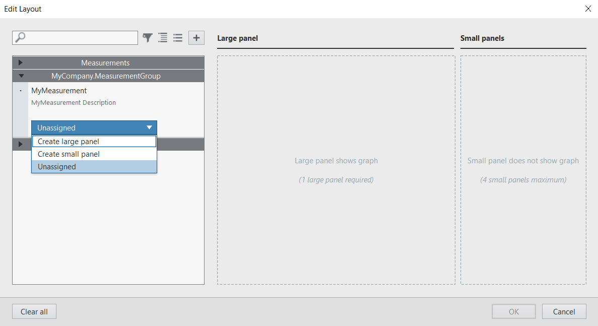

# Measurement Plug-In SDK for LabVIEW

- [Measurement Plug-In SDK for LabVIEW](#measurement-plug-in-support-for-labview)
  - [Introduction](#introduction)
  - [Software support](#software-support)
  - [Installation](#installation)
  - [Developing a LabVIEW measurement](#developing-a-labview-measurement)
  - [Running a LabVIEW measurement](#running-a-labview-measurement)
  - [Examples](#examples)
  - [Using a measurement in InstrumentStudio](#using-a-measurement-in-instrumentstudio)
  - [Creating a LabVIEW executable for static registration](#creating-a-labview-executable-for-static-registration)

---

## Introduction

The Measurement Plug-In SDK for LabVIEW packages enable measurement developers
to quickly create LabVIEW measurements and run them as a service. NI Measurement
Plug-In Support allows users to interact with measurement services with a
LabVIEW UI in InstrumentStudio.

---

## Software support

- InstrumentStudio 2024 Q3 or later
- LabVIEW 2020 SP1 or later
  - JKI VI Package Manager 2020.1 or later

---

## Installation

1. Install a supported version of
   [InstrumentStudio](https://www.ni.com/en/support/downloads/software-products/download.instrumentstudio.html#494650)
2. Install a supported version of
   [LabVIEW](https://www.ni.com/en/support/downloads/software-products/download.labview.html#487445)
3. Install a supported version of [Measurement Plug-In SDK for
   LabVIEW](https://www.ni.com/docs/en-US/bundle/measurementlink/page/labview-measurement-dependencies.html)
   from VIPM.

---

## Developing a LabVIEW measurement

1. Create and save a new LabVIEW project.

2. From the project window, go to `Tools` → `Plug-Ins` → `Measurement` → `Create
   Measurement Plug-in...`.
    - In the dialog, enter the `Measurement Plug-in Name` and `Measurement Plug-in Description`, then click `Create Measurement Plug-in`.

        

    - This will create a new measurement service library and a UI library.

        

3. Add the measurement details to `Get Measurement Details.vi`.

    

4. Add the required configuration parameters to `Measurement Configuration.ctl`.
   By default, there are controls showing most of the supported data types.

    

5. Add the required output parameters to `Measurement Results.ctl`. By default,
   there are indicators for most of the supported data types.

    

6. Add your measurement logic to `Measurement Logic.vi`. The VI has an input
   cluster with the configuration parameters from `Measurement
   Configuration.ctl` and an output cluster with the output parameters from
   `Measurement Results.ctl`. By default, the measurement logic takes the inputs
   and writes them to the associated outputs (a loopback measurement).

    

7. Add your user interface to `Measurement UI.vi`. The control and indicator
labels in the user interface must match the `Measurement Configuration` and
`Measurement Results` labels. If the data types and labels match, then the data
from the controls will be sent to the `Measurement Logic.vi` and the results
will be published to the indicators after the measurement is run. By default,
the UI file consists of controls and indicators mapped to all of the input and
output parameters for the measurement service.   
If your user interface has dependencies that are not available in the LabVIEW
runtime, you will have to build the UI into a packed library. For example, you
will have to build a packed library if your UI contains VIs from vi.lib or if
your UI depends on user created subVIs or controls. The packed library should be
located in a directory at the same level as `Measurement Logic.vi`. The
measurement template has a build spec for a packed library for the UI
demonstrating how to use a packed library user interface.

    

Note:

- Additional information can be found in the to-do sections in the code, which
  can be viewed using the `Bookmark Manager`. You can open it from the `View` →
  `Bookmark Manager` menu. In this window, you will find the bookmark term
  `#MeasurementToDo`. Double-clicking on the items will take you to the VI
  locations where changes need to be made for creating your unique measurement
  service.
- A list of supported datatypes for the `Configuration` and `Output` parameters
  of the measurement can be found in the NI Measurement Plug-In Support manual
  [here](https://www.ni.com/docs/en-US/bundle/measurementlink/page/supported-datatypes.html)

---

## Running a LabVIEW measurement

1. Open your measurement project.

2. Run the `Run Service.vi`.  A new window will appear, which provides basic
   information about the running service.

    

---

## Examples

The `Source\Example Measurements` directory contains example measurement
services. See the [README.md](../Source/Example%20Measurements/README.md) file
for more information.

---

## Using a measurement in InstrumentStudio

1. Open InstrumentStudio and click on `Manual Layout`.

2. Choose the desired measurement and create a panel.

    

3. The layout will be populated with the Measurement UI and the default configuration.

4. Modify the configuration if necessary and click `RUN` to run the measurement.

    

---

## Creating a LabVIEW executable for static registration

The generated measurement service includes two build specifications: one for the
UI and another for the service executable. The UI build specification must be
built first in order for the measurement service executable build to succeed. To
build them, right-click on the desired build specification and choose 'Build'.
